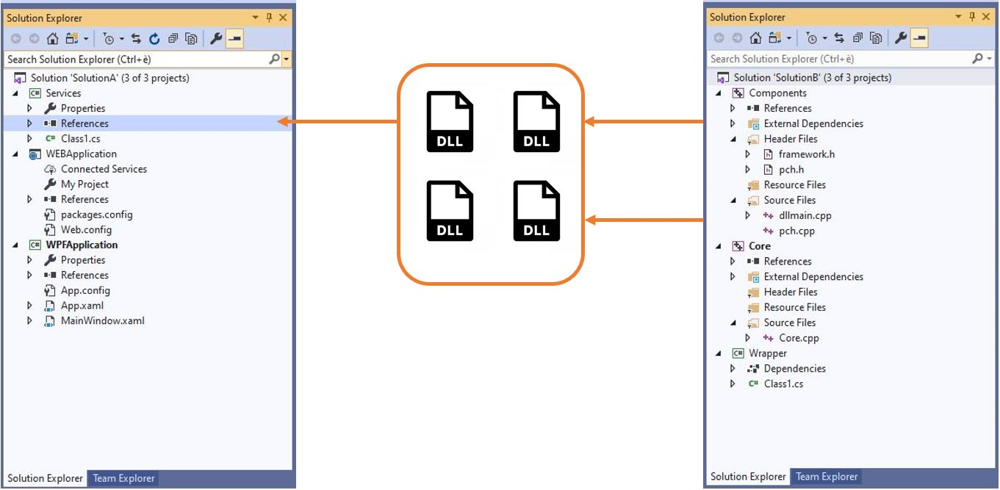

# Introduzione

Nel corso degli anni, l'aumento delle righe di codice sorgente dei software, con più team che lavorano sullo stesso prodotto, ha portato alla suddivisione di una unica soluzione in più soluzioni. Molteplici sono le motivazioni che hanno spinto verso questo cambiamento; le principali sono la riduzione del tempo necessario per la compilazione, la riduzione del tempo impiegato per l'integrazione delle soluzioni nonchè l'ottimizzazione dei tempi di avvio dell'ambiente di sviluppo popolato da centinaia di progetti.
La binary composition è la principale conseguenza dello spacchettamento della soluzione.

# Cos'è la binary composition?

Si parla di binary composition quando una o più soluzioni fanno riferimento a file binari prodotti da altre soluzioni. Nell'immagine seguente, sono rappresentate a scopo esemplificativo due soluzioni Visual Studio: soluzione A e soluzione B. La soluzione B contiene dei componenti ai quali la soluzione A si riferisce. E' quindi necessario che i file binari prodotti dalla soluzione B siano disponibili prima che la soluzione A possa essere compilata.

# Come possiamo distribuire i file binari?

Ci sono diversi modi in cui possiamo rendere disponibili i file binari.

## Repository Git

Una delle possibilità è fare commit dei file binari nel repository ogni qualvolta che lo sviluppatore richiede di fare merge con le sue modifiche nel ramo development/master - attraverso una Pull Request. Il tutto può essere realizzato mediante un processo automatico che si traduce in una pipeline di Continuous Integration. Naturalmente, questo comporterebbe l'aumento delle dimensioni del repository, introducendo tempi significativi di checkout e di prestazioni.
Immaginiamo cosa potrebbe accadere se i team lavorassero su rami diversi ritrovandosi ad utilizzare differenti versioni degli stessi file binari: si creerebbero sicuramente conflitti durante la fase di merge.

## Condivisione in cartella di rete

Un'altra opzione consiste nel caricare i file binari in una cartella di rete condivisa. Adottando questa soluzione non sarà però disponibile l'indicizzazione per facilitare la ricerca rapida dei file binari e inoltre non esisterà alcuna protezione contro l'override di una specifica versione.

## Gestione dei pacchetti mediante l'utilizzo di Azure Artifact

Questa rappresenta sicuramente la soluzione più adatta, poichè consente di inserire i file binari in pacchetti NuGet (e altri come npm, Maven, Python e Universal). In questo modo i progetti contenuti nella soluzione A possono fare riferimento a tali pacchetti.
Uno dei vantaggi introdotti da questa metodologia è la possibilità di aggiungere un task di pubblicazione NuGet nella pipeline di Continuous Integration di Azure DevOps, che automatizzi la procedura di versionamento del pacchetto e che renda la procedura di distribuzione più affidabile.