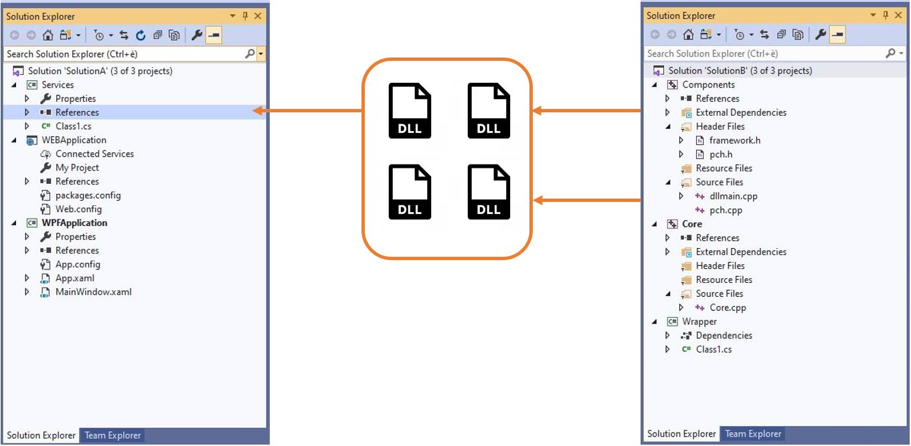

# Introduction

Continuously over the years the growing code base of application software with multiple teams working on the same product, has lead to break up the solution into multiple solutions, trying to reduce the time required for build and their integration, to ease Integrated Development Environment in opening hundreds of projects, and other.
The main consequence of having multiple solutions is binary composition.

# What is binary composition?

Binary composition occurs when one or more solutions reference the compiled binaries of another solution. Let suppose it is needed to make the binaries of Solution B available to Solution A before Solution A can build successfully.

Reader, If you change the code on Solution B and you have to commit the code together with the binaries produced by build in the repository...Keep on reading :)

## How can we distribute binaries? 

We can make those binaries available in several ways.

### Git repository
A first possibility consists in commit them into a repository anytime a merge into the development/master branch by means of the CI build pipeline is requested by a Pull Request. Of course, this increases the size of the repository introducing significant slowdown checkout times and performances. Imagine what could happen if teams work on different branches ending up using different versions of the same binaries creating merge conflicts.

### File share
Another option consists of putting the binaries onto a file share. In this case, however, there is no index for quickly finding binaries and there is no protection against overriding a version.

### Package Management with Azure Artifacts
This should definitely be the most suitable solution because it allows putting binaries into NuGet (and other as npm, Maven, Python, and universal) packages making it possible for Solution A to reference these packages. Among the several advantages introduced by this methodology, in Continuous Integration Azure pipeline a NuGet published task can be added in order to make the update versioning procedure automatic and distributing it in a reliable way also.