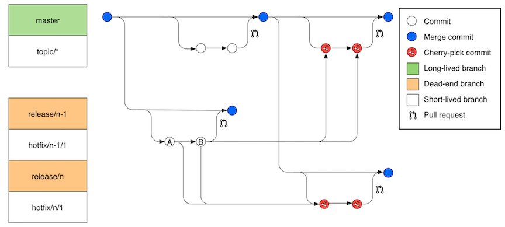
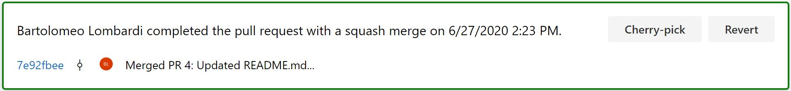
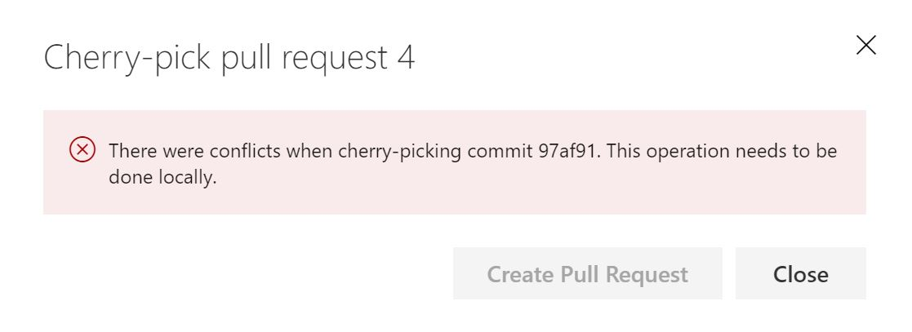
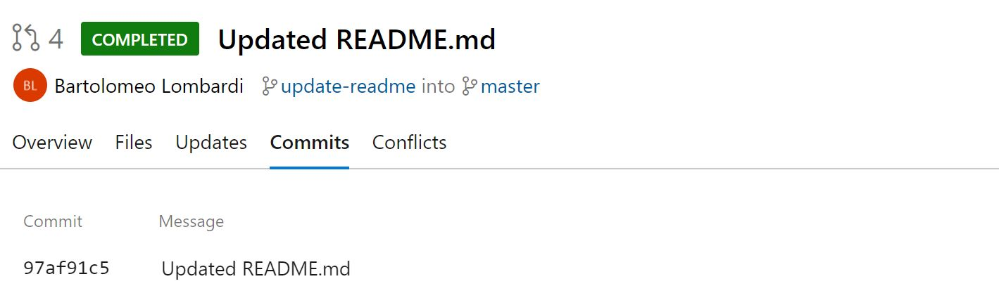

# Introduction

IT companies which develop and sell software product are always focused on delivering new features to propose new versions of them to the final client, while still considering the maintenance of the previous release.
Generally, we are talking about projects of millions of lines of code that requires multiple developing teams located around the world with strong coordination and collaboration among them, in which it is necessary to handle multiple versions of the same product with a significant number of release branches. Fixing a bug on multiple branches is a complex task because the developer needs to backport the same fix in the various release branches possible with Git and it is called "cherry-picking".

# Git cherry-pick

One of the most powerful Git commands is Cherry-pick. It takes one or more commits as input parameters and shifts them to a different branch, by creating a new commit in the process.

Cherry-pick is commonly used in many Git workflows such as the Azure DevOps team’s, described in the following [article](https://devblogs.microsoft.com/devops/improving-azure-devops-cherry-picking/), see the image reported below for a visual representation of the workflow.


Every time a developer works with many version of the same product it is essential to ensure all the reported bugs have been fixed in as many version as possible. Cherry-picking happens on the main branch to avoid deploying a new release with the same bug.

## Azure DevOps Repos

Azure DevOps provides cherry-picking of a completed Pull Request (PR) or of a single commit by clicking a dedicated button. The process will create a new PR with the same fix. 


Moreover, a [PR Multi-Cherry-Pick](https://github.com/microsoft/azure-repos-pr-multi-cherry-pick) is possible by means of an open source extension available on Azure DevOps Marketplace.

If Azure DevOps displays a warning about the cherry-picking not being performed automatically (see image below) this is related to conflicts generated during the merge, therefore it has to be performed locally. 


Many development environments integrated with Git can perform this local operation by graphic user interface. Best candidates are Visual Studio or VS Code.

# Git cherry-pick --continue

A few steps are needed to execute the following command [git cherry-pick](https://git-scm.com/docs/git-cherry-pick). 

The first step is noting of the hash commit value to cherry-pick. If within a PR, the list of commits is available in the **Commits** tab in Azure Repos:


Once you are on the branch (```git checkout <branch-name>```) that you want to commit, the following command must be executed ```git cherry-pick <commit>```.

Knowing that the cherry-pick command shown in the previous example can generate another conflict, once the code is merged manually you need to run the ```git cherry-pick --continue``` to proceed. If you want to abort the process simply run git ```cherry-pick --abort```.

All you need to do now is to perform ```git push``` to align the remote.