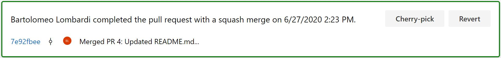

# Introduzione

Le aziende IT che sviluppano e vendono un prodotto software sono sempre più concentrate sui rilasci di nuove funzionalità per proporre nuove versioni, senza tralasciare la manutenzione delle precedenti, utilizzate dai clienti. 
Generalemente si parla di progetti di milioni di righe di codice che prevedono più team di svilupattori siti in tutto il globo con una forte coordinazione e collaborazione tra loro, in cui si trovano a dover maneggiare più versioni dello stesso prodotto con un numero significativo di rami di release.
Fissare un bug su più versioni è un compito oneroso poichè lo sviluppatore deve riportare le stesse correzioni nei vari rami di release. Quest'ultima azione in Git è possibile ed è detta "cherry picking".

# Git cherry-pick

Uno tra i più potenti comandi che git mette a disposizione è il cherry-pick. Questo comando prende in input uno o più commmit e applica gli stessi cambiamenti su un ramo differente, attraverso la creazione di un nuovo commit. Infatti, la "raccolta di ciliegie", letteralmente, è l'atto di scegliere un commit da un ramo e applicarlo su un altro. 

Il cherry-pick è un comando estremamente efficace in molti flussi di lavoro basati su Git come ad esempio quello usato dal team di [Azure DevOps](https://docs.microsoft.com/en-us/azure/devops/learn/devops-at-microsoft/release-flow) come descritto nel seguente [articolo](https://devblogs.microsoft.com/devops/improving-azure-devops-cherry-picking/), di cui riporto un'immagine che rappresenta il sopracitato flusso di lavoro.


Quando si lavora con più versioni dello stesso prodotto è indispensabile assicurarsi che tutti i bug segnalati siano correttamente risolti e che tutte le versioni in vita del prodotto siano conseguentemente aggiornate; tale azione viene effettuata anche sul ramo main al fine di evitare di creare una nuova release con lo stesso bug.

## Azure DevOps Repos

Azure DevOps mette a disposizione il comando cherry-pick di una Pull Request (PR) completata o del singolo commit, direttamente dalla piattaforma. Tale meccanismo crea una nuova PR con i medesimi cambiamenti sul ramo su cui si necessita della fix.


Inoltre, è possibile effettuare un cherry-pick multiplo con pochi click, grazie ad un'estensione open source scaricabile ed installabile attraverso il marketplace di Azure DevOps [PR Multi-Cherry-Pick](https://github.com/microsoft/azure-repos-pr-multi-cherry-pick).

Molte volte è possibile ritrovarsi nella medesima situazione dell'immagine sottostante in cui Azure DevOps avverte che non è possibile effettuare il cherry-pick del commit automaticamente in quanto la modifica che si sta implementando genera conflitti e va, pertanto, effettuata in locale.


Ci sono molti ambienti di sviluppo che si integrano con Git e permettono di effettuare tale operazione attraverso un'interfaccia grafica. Per esempio Visual Studio o VSCode sono degli ottimi candidati.

## Git cherry-pick --continue

Sono necessari pochi passi per effettuare il procedimento di [git cherry-pick](https://git-scm.com/docs/git-cherry-pick) da riga di comando. 

La prima azione e' prendere nota dell'hash dei commits di cui si intende effettuare l'azione di cherry-pick; nel caso specifico di una PR l'elenco dei commit e' consultabile nella tab **Commits** in Azure DevOps Repos, come mostrato nell'immagine seguente.


Spostandosi sul branch (```git checkout <nome-branch>```) in cui si intende portare il commit si deve eseguire il comando ```git cherry-pick <commit>```. 
Siamo a conoscenza che il cherry-pick di questo commit causa conflitto, quindi una volta effettuto il merge manuale con Visual Studio (o altri IDE) va poi lanciato ```git cherry-pick --continue``` per procedere con l'operazione; se invece si vuole terminare il procedimento basta digitare ```git cherry-pick --abort```.

Una volta completato il processo va effettuato un ```git push``` del nuovo commit generato.
