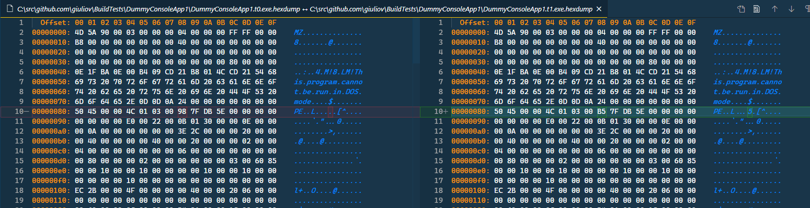
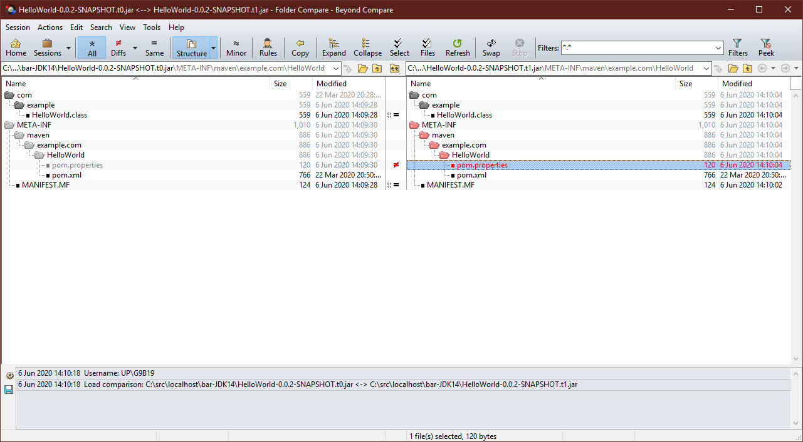
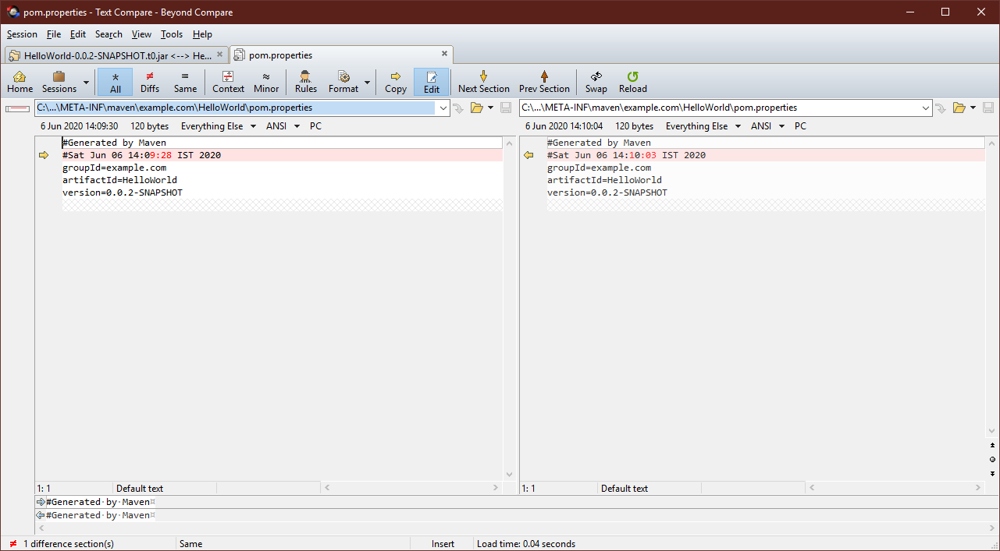
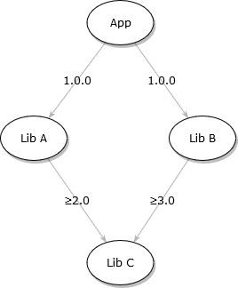

The topic is huge and I do not have the room to go through all the details in one post, so I stick to a cursory view. I will sprinkle references to additional material so you can deep dive later.


## What is a 'flaky' build?
A 'flaky' build is a build whose outcome is, in some ways, unpredictable. This is generally bad because you expect your CI to be algorithmic, deterministic, with no randomness. The worse consequence of an unpredictable build lies in the future: that day when you run the same build, maybe in the hurry of delivering a patch, and it fails unexpectedly. Some may think that is is just another piece of evidence for Murphy’s Law[^1], which applies to all time and space.
The unpredictability may be subtle; for example, the build always succeeds but its results are never quite the same.
In the following, I will review the most common flakiness scenarios.


## Same source, different binaries

Have you tried comparing binaries built on two different machines? More often than not, they will be different! Even if you use the exact same source code version. Worse, even on the same machine, rebuilding the same code at a later time will produce different binaries.

My first example is a .NET 4.x assembly: the next picture shows the binary difference between files built from the same sources a few minutes apart.

Traditionally Microsoft tools embedded some kind of build timestamp in binaries for a number of reason, especially to help Windows' Loader[^2].

I obtained a similar result with Maven building a JAR package, I used Beyond Compare to compare more easily.

The difference is in the `pom.properties` manifest, which contains a time-stamp marking when the package was built.


There are ways to fix these behaviors and join the camp of repeatable builds, like myself.

### Why should I care?

The ability to compare binaries helps or is even required in many circumstances:
 - troubleshooting, you can quickly compare a binary file generated on your machine with another from unknown source;
 - deployment, you can skip copying/deploying binary identical files;
 - patching, generating binary patches is easier;
 - auditing, you can demonstrate the version of code that is running in production matches source code;
 - security, the binary hasn't been tampered by an attacker.

Hope this convince you that these goals are worth your time and effort. Auditing and security are becoming of greater importance these days.

### Reproducible builds

Let's state a clear goal, we want reproducible builds that generate identical _main_ artifacts when using the same version of source code.
What do I mean with _main_ artifacts? That we allow for ancillary artifacts to change at every run; a trivial example is a build log or release note file. We forbid differences in executable binaries, data or configuration files, scripts and tools.
With this definition, a release note file displaying a build id or timestamp is fine.

To achieve this goal, you have to look at the tools' manuals. I will detail a few common scenarios.
In addition to the following suggestions, you have to consider a proper archival and versioning of the toolchain in use to build the software. A newer version of compiler, SDK, build may produce different results.

### .NET Reproducible builds

The Roslyn C# compiler offers the [`-deterministic`](https://docs.microsoft.com/en-us/dotnet/csharp/language-reference/compiler-options/deterministic-compiler-option) flag a few years now, that is, from Visual Studio 2015. You turn on the option setting the `Deterministic` MSBuild property to `true` in the project file.

```xml
  <PropertyGroup>
    <Deterministic>true</Deterministic>
    <PathMap>$(MSBuildThisFileDirectory)=\src</PathMap>
  </PropertyGroup>
```
By the way, you do not need to rush editing you project files to set these properties. You can add a `Directory.Build.props` file[^3] at the root of your project and the setting will be applied to all projects under the same directory.
I have a good news: .NET Core SDK projects use the `deterministic` flag by default. The bad news is that it is not enough in some cases, but keep on reading.

In the above example, you have surely noted another property, `PathMap`, which matches the [`-pathmap`](https://docs.microsoft.com/en-us/dotnet/csharp/language-reference/compiler-options/pathmap-compiler-option) compiler option. This option alters the paths embedded in executables and PDBs[^4] and is especially useful when building on a server. Typically each agent on the server has a different base directory, and the generated files embed the agent specific path. With `PathMap` you define a conventional directory (`\src` in the example) independent from the effective directory used for the build.
A useful resource is Jared Parsons' post [_Deterministic builds in Roslyn_](https://blog.paranoidcoding.com/2016/04/05/deterministic-builds-in-roslyn.html).

### Maven (Java) Reproducible builds

It is very easy to replace the timestamp in `pom.properties`, just add a `project.build.outputTimestamp` property
```xml
  <properties>
    <project.build.outputTimestamp>2020-06-06T22:12:34Z</project.build.outputTimestamp>
  </properties>
```
to the `pom.xml` file. This requires that you use a recent version (3.2 or later) of Maven plugins. You can find all the details in [_Configuring for Reproducible Builds_](https://maven.apache.org/guides/mini/guide-reproducible-builds.html).

The `pom.properties` solves the simple issue but there are additional data, used during build, that can produce different outcomes. A more through approach use the [Reproducible Build Maven Plugin](https://zlika.github.io/reproducible-build-maven-plugin/) which guarantees identical binaries given unchanged sources.

### Other languages

C/C++ developers can profitably study [An introduction to deterministic builds with C/C++](https://blog.conan.io/2019/09/02/Deterministic-builds-with-C-C++.html); this article explores the main issue on each major platform (Windows, Mac, and Linux).
I recommend the <https://reproducible-builds.org/> site for Linux and C/C++ information about Reproducible builds.
C/C++ reproducible can be complex to implement, caring for lots of detail, so I do not even dare to start in a short article like this one.

Go language has its quirks too. You may want to avoid the C compiler and linker, using the `CGO_ENABLED=0` setting, or embrace complexity. The other main issue is path strings embedded  in binaries. The [`-trimpath`](https://golang.org/cmd/go/#hdr-Compile_packages_and_dependencies) flag, available with Go 1.13 and later, resolves using a conventional path (similar to C# `-pathmap`).


## Same definition, different set of files

Dependencies are the next source of troubles for build predictability. I see this as a separate topic from reproducible builds because the focus is not the individual file you coded, but the general outcome and files outside your direct control.

The issue caused by dependencies is simple to describe. Your project depends on, at least one, external file. The first time you build, you get a version of this external file, say v1.0. The next time you build, the version for the external file is different: it can be v1.0.1, v1.1, v2.0 or else.

We can set apart four reasons for non-predictable outcomes when it comes to dependencies:
 * Loose specification & newer packages versions available;
 * Newer versions available for indirect dependencies;
 * Loss of package source (direct or indirect);
 * Change in package manager and its algorithm.

### Loose dependencies specifications

Every modern library manager permits to specify a strict or a loose rule for a dependent file. The strict rule states a unique version for the library package. A loose rule defines a range of acceptable versions.
When the library author publishes a new version, what happens to your build depends on the rule. A strict rule will always retrieve the same version, a loose rule may force the package manager to download a different version. Let's see a practical example.

 Date | Dependency Rule| Available versions      | Version selected
:----:|:--------------:|:-----------------------:|:----------------:
1 Jan | = 1.0          | 1.0                     | 1.0
1 Jan | 1.0<= and <2.0 | 1.0                     | 1.0
1 Feb | = 1.0          | 1.0, 1.1                | 1.0
1 Feb | 1.0<= and <2.0 | 1.0, 1.1                | 1.1
1 Mar | = 1.0          | 1.0, 1.1, 1.2, 2.0      | 1.0
1 Mar | 1.0<= and <2.0 | 1.0, 1.1, 1.2, 2.0      | 1.2
1 Apr | = 1.0          |           1.2, 2.0, 2.1 | error
1 Apr | 1.0<= and <2.0 |           1.2, 2.0, 2.1 | 1.2

In this example, after the author publishes a new minor version, the build (_rectius_ the package manager) use the new minor version for the looser rule, while the strict rule stick to version 1.0.
You may have noticed the 7th line, the build using the strict rule fails because the required version of the package is no more available. This is not the scenario we will discuss in [_Lost source_](#lost-source), but the solution is the same.
Note that some package managers do not select the most recent version of a package (Maven is an example).

### Indirect dependencies

The [above](#loose-dependencies-specifications) scenario is very simple because it analyses a direct dependency, i.e. the code you are building directly depends on the specified library version.
This is rarely the case in practice: the libraries you use depends on other libraries and so on. On average a project has a couple of hundred dependencies, direct or indirect [^5].

While you can set very strict rules for your direct dependencies, you have no control on indirect dependencies. Only the library author can define the rules for the latter.
Let's see a simple example.



We say that **Library C** is a transitive dependency for App.
**Library A** requires at least version 2.0 of **Library C** while **Library C** requires a minimum 3.0 version. The package manager will pick version 3, which may have unexpected effects.

There is a solution to this and the previous issue and is generally referred as _locking_.

### Fixing loose specifications and indirect dependencies

The most used library package managers offer a _locking_ mechanism: the tool evaluates the whole dependency graph, determining the set of version that satisfy all dependency rules, save the result in a  _lock_ file, and use such result from now on without evaluating again. This mechanism is sometimes called _pinning_ or _fixing_ library versions, as you are taking a snapshot of dependency graph at a point in time.

**NuGet** uses [`packages.lock.json` file](https://github.com/NuGet/Home/wiki/Enable-repeatable-package-restore-using-lock-file) to control locking. The presence of the file, even empty, triggers the mechanism. You can have this file at the project level (e.g. same directory as `.csproj` project file) or at the root of the Git repository, depending how you prefer managing dependencies.

**Maven** requires that you use the [`<dependencyManagement>` stanza](http://maven.apache.org/guides/introduction/introduction-to-dependency-mechanism.html#Dependency_Management) to define the versions for direct and indirect dependencies. This mechanism is not 100% robust, so the community has devise some plugins to help manage the list and detect violations like [dependency-lock-maven-plugin](https://github.com/vandmo/dependency-lock-maven-plugin).

**Gradle** offers a very sophisticated mechanism based on a set of [lock files](https://docs.gradle.org/current/userguide/dependency_locking.html). It is an opt-in mechanism that requires modification to the `build.gradle` script.

**npm** uses [`package-lock.json`](https://docs.npmjs.com/configuring-npm/package-locks.html) file.

Python has a few tools to solve this problem. Notable is [pipenv](https://github.com/pypa/pipenv) which uses `Pipfile.lock`. In a build script, you use the `pipenv sync` command which uses the `Pipfile.lock` exclusively.

### Lock files and pipelines

Once the lock file is generated, commit it to source control. This guarantees that others developers, and build pipelines use the same lock file as you.

Be aware that the content of lock files is not written on stone. If you change the main dependency file (`.csproj`, `packages.config`, `packages.json`, etc.), the library package manager updates the lock at the first run, unless you block this behaviour. In a build must **always** force the use of a lock file, that is:
 - set MSBuild `RestoreLockedMode` property to `true`;
 - use `dotnet restore` command with the `--locked-mode` option;
 - use `npm ci` **not** `npm install`;
 - use `pipenv sync` **not** `pipenv install`;
 


### Lost source

We still have one scenario depicted in the table: how to cope with library versions that are no more available.
If you think that it never happens, please read the [story of left-pad](https://www.theregister.com/2016/03/23/npm_left_pad_chaos/).

The solution is to add some kind of buffer between your build and the external world, a storage for input artifacts. There quite a number of products, generally labelled as _Artifact Store_ or  _Artifact Manager_: [Artifactory](https://jfrog.com/artifactory/), [MyGet](https://www.myget.org/), [Nexus](https://www.sonatype.com/product-nexus-repository), [ProGet](https://inedo.com/proget), [Azure Artifacts](https://docs.microsoft.com/en-us/azure/devops/artifacts) and so on.

These products require some tweaks on the build configuration so that the library package manager asks the Artifact Manager before going to the original source. NuGet uses the [`NuGet.Config` file]() at machine or user level to search for sources; npm leverages the [`registry`](https://docs.npmjs.com/misc/config#registry) key in its configuration and so on.
The Artifact Manager returns the library package, if available locally, or goes to the original source and cache it locally.

Artifact Managers offer support to the most common library package formats (Maven, npm, NuGet, etc.) and a caching mechanism that shields you from a sudden disappearance of a library.

### Tool chain issues

The final piece is the library package manager tool itself. Matching algorithms, syntax, all might change on newer version. It is important to have copies of the executable, its configuration.
The golden rule is being able to recreate the exact build environment that was used at any point in the past. I discussed the value of Docker in details in [this article](http://blog.casavian.eu/2019/08/19/meta-pipelines-introduction/).


## Same tests, different results

Flaky tests are the third major cause of uncertainty in builds. Flaky tests randomly pass or fail despite the build being identical.

What kind of test can be so unpredictable? Tests that depends on external resources. For example, you deploy a web application and run a smoke test that checks if the site is up; if the web application host is slow to start, the remote call may time-out and the test fails. Unit tests, by definition, do not depends on external resources, so your focus should be on integration tests. Design integration tests for predictability; it is better that a whole suite of tests fails. e.g. by checking connectivity at entering the suite, than having a random test of the suite failing. Another scenario might be that tests have an implicit order, and the runner executes them in parallel, thus the random outcome.
Martin Fowler wrote a beautiful [essay on flaky tests](https://martinfowler.com/articles/nonDeterminism.html) and I recommend studying it to gain a deep understanding why this happens and some preventions.

### How to harness 

Practitioner have to face the reality of unforeseen problems. Luckily, modern build tools offer some relief.
You can automatically re-run failed tests and report which tests pass on the second (or more) attempt.
 - in Azure DevOps you turn on this feature at the project level (<https://docs.microsoft.com/en-us/azure/devops/pipelines/test/flaky-test-management>);
 - Jenkins has a plugin named [_Flaky Test Handler_](https://plugins.jenkins.io/flaky-test-handler/) somewhat limited;
 - GitLab suggests a [sophisticated process](https://about.gitlab.com/handbook/engineering/quality/guidelines/debugging-qa-test-failures/#flaky-test) that accounts for a number of failure scenarios, allowing tagging tests so the build pipeline knows about flakiness or other issues.


## In summary

We explored cursory the topic of non-predictable builds. The root of randomness may lie in the compiler, the linker, the library manager, the dependency manager, in the test suites.
There are options, tools and techniques that help in minimise or even completely get rid of variation and have fully reproducible builds.
You should aim at repeatable, even reproducible builds: they are a defense weapon for the developer in the modern world.
A final word for the tool-chain. If you need to go back and rebuild years old versions, you must archive the exact set of tools you use for building and keep it safe. A different version for a compiler or a library manager can have a big impact on your ability to reproduce an old version.

---

[^1]: "Anything that can go wrong will go wrong".  
[^2]: Raymond Chen's post [What is DLL import binding?](https://devblogs.microsoft.com/oldnewthing/20100318-00/?p=14563) and also [Why are the module timestamps in Windows 10 so nonsensical?](https://devblogs.microsoft.com/oldnewthing/20180103-00/?p=97705).  
[^3]: MSBuild documentation [Customize your build](https://docs.microsoft.com/en-us/visualstudio/msbuild/customize-your-build).  
[^4]: Program database (PDB) is Microsoft's file format for storing debugging information.  
[^5]: Source [GitHub](https://octoverse.github.com/#dependencies-overview): "_203 package dependencies, on average, support every public and private repository with an enabled dependency graph_"  
