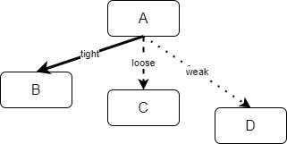

What do I mean when I say "_Galactic Builds_"? Is is about building a [Dyson sphere](https://en.wikipedia.org/wiki/Dyson_sphere)?

No, I mean an excessive build pipeline that is trying to swallow too much in one gulp. While the idea of a single script building, packaging, deploying and testing your application is extremely attractive, one has to counterbalance resource consumption, wait times and modularity of the solution.

Humongous builds that take hours to finish are much less useful than smaller builds that give feedback to developers in minutes.

## Do too much and takes too much

Do huge builds exist? Yes.

In one company, I found these huge pipelines taking anything from 30 minutes to 5 hours before finishing. In this case the build was compiling **all** source code of a complex system, neat a million lines of code, **every single time**, **at every check in/commit** in version control. While logically the system could have been easily decomposed in binary libraries, everything was rebuilt from scratch every time. It was not a single pipeline, but one build chained other, and another and so on.
In another case, the compile phase of the build pipeline was fast but the testing process took hours to finish. Single threaded UI testing. No unit testing, no API level testing, just UI testing.

## Why it happens?

In many cases, it results from the same forces as technical debt in code. A system outgrows the initial design and become harder to evolve. The real solution is paying back the debt and start refactoring the system. In a similar vein, you add a feature to your pipeline, then another component, than another, and, finally you have a monster.
In one particular case, the person who implemented the pipeline interpreted continuous integration to an extreme and pretended to rebuild the whole system from source code every single time, even for development branches.

## Think

Designing the build and deploy process for a system requires an holistic look at all components and dependencies.

In the diagram, `B` depends tightly on `A`, which means that `B` must rebuild at every change of `A`. In contrast `C` has a loose dependency on `A`: catching up is important for C owners. `D`, finally, has a weak dependency: as long as few stable API do not change, there is no need to upgrade.
Note that I am not saying anything specific about the granularity of such components: they can be modules within the same application, or they can be autonomous systems. What we focus here is dependencies at _build_ and _test_ time.

The `A->B` dependency requires, what I call, a _push_ approach: `A` build must trigger `B` rebuild. It can be accomplished using a build chaining mechanism (`A` chains `B` as last step) or a trigger (`B` senses that `A` was built and starts automatically). The push approach works very well only if each component of the system can be independently deployed. It does not work well when the system is released as a whole, in scenarios like shrink wrapped or embedded software, and the system size is non trivial.

The `A->D` dependency instead is managed using a _pull_ approach: `D` owners decide when they have to pick a new version of A, align their code and rebuild. Note that this works both for binary dependencies and source code dependencies (think how [Git submodule](https://git-scm.com/docs/gitsubmodules) works).

It is important that the type of dependency is made clear on both sides, even if they are managed by the same team. The Java/[Maven SNAPSHOT](http://maven.apache.org/guides/getting-started/index.html#What_is_a_SNAPSHOT_version) pattern for example clearly labels a version to be used only by tight dependencies.

There is more to say to the topic of managing dependencies — e.g. how to resolve conflicts in cascade dependencies — but it is outside the scope of this post.

## Slow feedback

Developers need a fast feedback; a team cannot work together and discover trivial issues in their code after hours or worse the next day. If you suffer of a slow build consider a few of the following techniques to improve build times and feedback.

Have a fast build associated with commits on developer branches, building the minimum amount of code possible, running only unit tests. Pull Requests allow for longer build times, as some human has to review the code anyway. Moving from source code dependencies to binary libraries helps shortening build times.

In same cases, parallel build can help. This is a feature available in quite a few toolchain: [MSBuild](https://docs.microsoft.com/en-us/visualstudio/msbuild/building-multiple-projects-in-parallel-with-msbuild), Visual Studio [C++](https://docs.microsoft.com/en-us/cpp/build/reference/mp-build-with-multiple-processes), [GNU make](https://www.gnu.org/software/make/manual/html_node/Parallel.html), 
[IncrediBuild](https://www.incredibuild.com/), [Maven3](https://cwiki.apache.org/confluence/display/MAVEN/Parallel+builds+in+Maven+3), [npm](https://www.npmjs.com/package/npm-run-all), [gradle](https://guides.gradle.org/performance/#parallel_execution) to name a few. In general, this technique is effective for steps, like compiling , which use a lot of CPU: the load is spread amongst the CPU core available on the machine.

Integration testing and, in particular UI testing, are intrinsically slow processes.
Parallelisation can mitigate but requires discipline in test authors to define dependencies between the tests themselves. Most frameworks and runners offers this option: [dotnet vstest](https://docs.microsoft.com/en-us/dotnet/core/tools/dotnet-vstest#arguments), [xUnit](https://xunit.net/docs/running-tests-in-parallel.html), [NUnit3](https://github.com/nunit/docs/wiki/Framework-Parallel-Test-Execution), [JUnit5](https://junit.org/junit5/docs/5.3.0-M1/user-guide/index.html#writing-tests-parallel-execution), [mocha](https://www.npmjs.com/package/mocha-parallel-tests), [tap](https://node-tap.org/docs/api/parallel-tests/), [karma](https://www.npmjs.com/package/karma-parallel), etc. Notable is [Selenium Grid](https://www.selenium.dev/documentation/en/grid/) to run tests in parallel on multiple machines.

In addition, consider to run slower tests asynchronously, in their own build, or periodically scheduled, so it does not block other builds.

One last notable technique offered by modern testing tools is [Test Impact Analysis (TIA)](https://martinfowler.com/articles/rise-test-impact-analysis.html).
The basic idea is to analyse which parts of the source code changed from the previous test run. The compiler notes which tests refer to the changed parts (classes, methods, parameters) and mark them for future execution. The test runner uses the information from the compiler to run only the marked tests.
This is a preeminent feature of Azure DevOps [TIA](https://docs.microsoft.com/en-us/azure/devops/pipelines/test/test-impact-analysis).

## In summary

You can use a number of techniques to shorten the duration of your builds, parallelisation, scale-out, TIA, but the most important thing is the mindset of eliminating waste. Consider the purpose of each build and remove anything that may slow down developers. Finally, technical debt is not restricted to application code: your pipelines will suffer of technical debt as well.
