# Intro

As we all know, DevOps is culture. In a company that is going to adopt its practices and principles, everyone should be "on the same side". Continuous improvement cannot be part of our work in IT if we wouldn't reduce the gap between development and operations. People like me, that worked in the 90s, know that dev and ops were always isolated in silos and this was "the only" way that everyone followed as a suggestion taken from the market leaders. Ticketing systems and extreme bureaucracy acted as a man-in-the-middle between those silos, transforming each organization in two people-unaware endpoints.

Speaking from a DevOps perspective, in such circumstances, a developer couldn't know anything about how to deploy, where and how is an environment configured. On the other hand, an operation guy couldn't get anything from a package in terms of what the application has been made for. Due to this gap we often see performance issues, underestimated hardware stuff and delayed releases. Last but not least, what about the lack of commitment and accountability of the employees working on the solution? In short, reducing such a gap is possible using a combination of DevOps culture and the right tools. We will see hereafter how my organization tries to do so using Azure DevOps.

## Scenario

Let's get started with our team (DevTeam hereafter), which is working with agile methodologies, composed of ten developers and a PO. A quick note, we are using a process decision framework called [Disciplined Agile](https://www.disciplinedagileconsortium.org). Then, we have three operation professionals (OpsTeam from now on). Build and deploy pipelines already exist. Builds are hosted by [Azure DevOps (cloud)](https://azure.microsoft.com/it-it/services/devops/) and deploys are managed by [Octopus Deploy](https://octopus.com/). Getting this, has been a difficult mission.

Everything is related to infrastructure in terms of servers, operative systems, virtual hosts, DNS, firewalls, security and so on, is the responsibility of our OpsTeam. As a result, they do many tasks for managing the environments. Here comes the problem. DevTeams used to create tasks in a dedicated backlog, but OpsTeam didn't. It's not just a matter of end-of-pipeline tasks, but also tasks for their daily basis work.

## Our solution

Modify the tool, adapting its shape in order to fit in with that real scenario. A piece of cake, when you're DevOps "inside". How did we change Azure DevOps? Let's describe what we did in three parts:

### Teams in Azure DevOps

To create a team in Azure DevOps is really a piece of cake (according to the latest releases). Just navigate to the options and select _Teams_:

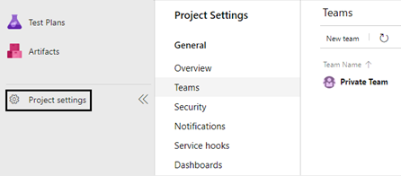

We can add many teams clicking on _New team_:

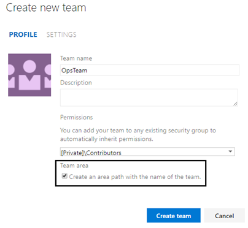

We can set the team's administrators, the permission set and an area under which every work item will be created. This area will be one of our best friends, especially when we will make our queries for gathering and analyzing the team's related data. Additionally, also the other teams' members could create items with this area in order to make the OpsTeam aware of them.

Team's backlog
Now let's navigate to Backlogs:

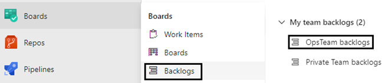

Good! The new backlog has been created. Going on it, we will see the team's drop-down as well as the one for iterations. Great feature!

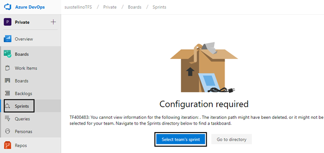

Once created, we will see the teams' drop-down:

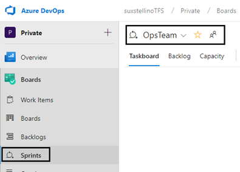

### Work items

Now, let's create a new work item type. We call it Ops item. Navigate to Process customization page:

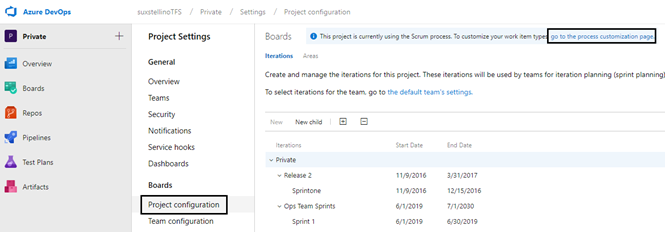

Before adding the new work item, we must ensure that the process is already a custom process, otherwise, all the edits will be blocked as shown in the following picture:

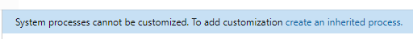

We've already created a SimplifiedScrum process. let's add our item now:

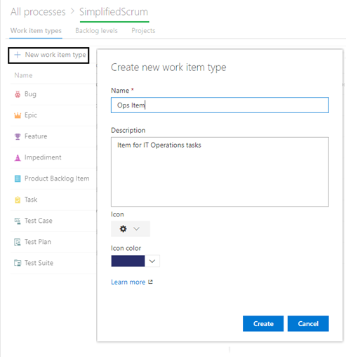

Now we are going to modify the fields of the new type. Each team should be able to understand all the item's properties. We will leave the item as is in this example. Then, we have to map the type to the backlog item list, since only the default work item types are shown initially. To do this, navigate to the Process customization page, Backlog Levels tab:

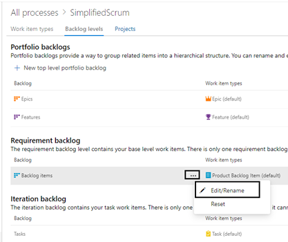
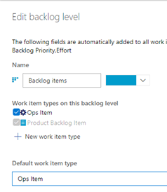

As we can see, we can also set the default item for our requirements backlog. Moreover, every Sprint backlog, based on iterations, will enable us to add the new Ops item:

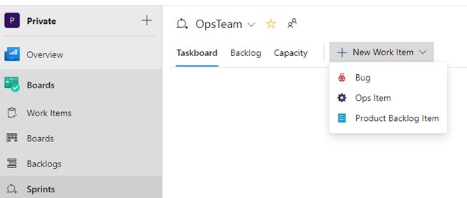

### Wrapping up

So, we've got a backlog for the IT Operations team's members. Then, we've related it to their Azure DevOps team. Additionally, we've got a particular work item type (not mandatory, but really useful for querying it or adding it into dashboards) target of IT Operations' job and a dedicated Area Path. We can make many relationships between items of both our backlogs. Here is an example of how an activity can be managed and organized (extension: [Work Item Visualize](https://marketplace.visualstudio.com/items?itemName=ms-devlabs.WorkItemVisualization)):

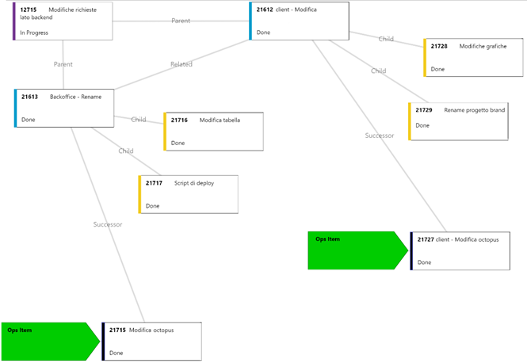

As you can see, the Ops items are _Successor_ of the "development" Product backlog items. Indeed, the Ops Items will be finished after the PBI, typically. Think about creating s DNS or a network path to let the production app work in production.

## Conclusions

With this solution, we're decoupling backlogs. Moreover, we're isolating the management maintaining the relationships between work items that reside on different boards. At the same time, we're making a strong synergy between Development and Operations.
Then, in a couple of clicks, we can switch teams and backlogs, using Azure DevOps Boards. We can track changes in both the departments, also for audit requirements. In my opinion, this helps the enterprise awareness and facilitates the continuous improvement of all the teams and any member's skill.
