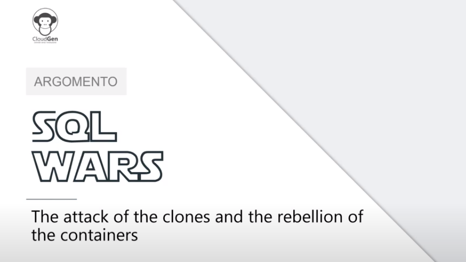

Getlatestversion ha partecipato a [HomeGen](https://cloudgen.it/home-gen-events/), una bellissima iniziativa dei nostri amici di [CloudGen Verona](https://cloudgen.it/). 

[Alessandro Alpi](https://www.getlatestversion.eu/it/authors/suxstellino/) e [Giuliano Latini](https://www.getlatestversion.eu/it/authors/giulianolatini/) hanno presentato "SQL Wars, l'attacco dei cloni e la ribellione dei container", una sessione su come fare provisioning dei dati di produzioni in ambienti diversi tramite qualche click o in automation.

La registrazione della sessione è disponibile nel video seguente sul nostro [canale YouTube](https://www.youtube.com/c/getlatestversion).


