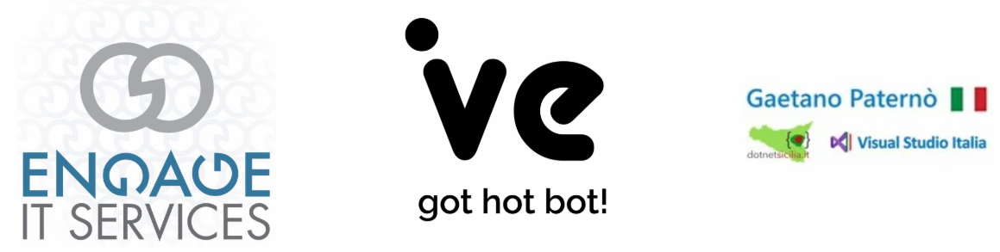

# L'evento

Come membro di [getlatestversion.eu](https://getlatestversion.eu) vorrei condividere con voi un evento che sto organizzando insieme agli amici di [IVE](https://ive.ai) e di dotnetsicilia ([Gaetano Paternò](https://www.gaetanopaterno.it)). Vogliamo provare a sfruttare la potenzialità degli strumenti di streaming in nostro possesso per offirvi una giornata all'insegna delle esperienze di vita reale aziendale ai tempi del covid-19. 

Stiamo tutti vivendo un momento particolare e complesso. Uno di quei momenti che segnano tristemente la storia in maniera indelebile. Ma come spesso accade, dimostriamo la nostra forza reattiva. Da situazioni di questo tipo emergono tantissimi aspetti positivi derivanti da persone e iniziative. Come una fenice che rinasce dalle proprie ceneri, la nostra società risorge in termini di pensiero comune e controbatte ogni attacco inferto dall'ormai sottinteso virus.

## La call for paper (CFP)

Non siate timidi, condividere esperienze è sempre molto interessante. Chiunque parteciperà potrà avere feedback interessanti da ognuno dei presenti nella stanza.
Ecco il link per [proporre la sessione](https://sessionize.com/digital-warriors-2020/)

## Iscrizione gratis

[Qui potete registrare](https://biglietti-digital-warriors-2020.eventbrite.it/) la vostra partecipazione. Bastano pochi click e riceverete le istruzioni via email.

## Mission

In questo evento virtuale, avremo racconti e testimonianze dirette sul campo. Storie di aziende e persone che hanno cambiato se stessi, le aziende in cui lavorano e le altre persone, unitamente alla cultura del lavoro. Idee di professionisti utili a costruire anche un trend di ripresa e di miglioria del mondo in cui viviamo.

Ognuno di noi vuole portare valore aggiunto descrivendo come la propria realtà ha reagito al momento e perché alcune scelte sono state prese. Non capita spesso di avere persone che descrivono tutto ciò in un momento storico come quello che ha caratterizzato e sta caratterizzando gli ultimi mesi.

Vogliamo condividere le reazioni ai problemi iniziali, le azioni correttive, gli strumenti applicati, il vivere giorno per giorno, la gestione di emergenze, pericoli, lavoro remoto, smart e le idee di gestione.

## Grazie

Eventi come questi, **completamente gratuiti**, non sarebbero possibili senza lo sforzo, il contributo e il lavoro volontario dei nostri aiutanti sul campo.
Combattenti digitali, anche da casa!

