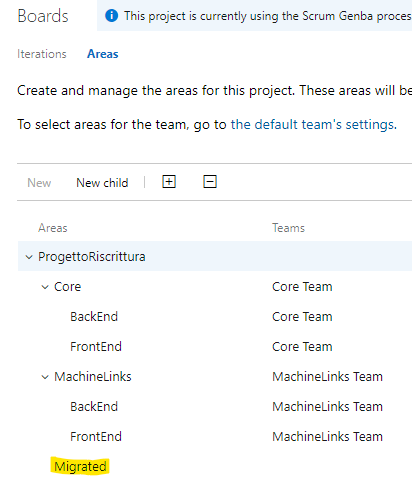

# Intro

Migrations are hard tasks to deal with. Not just for IT. Working with the culture of many companies, I've got confirmation that the tool should be considered at the end of the migration process. After setting up the ceremonies and switching the methodologies from legacy to lean/iterative, it comes finally to choose from the available tools (_enterprise awareness_) and including new ones. The goal is to get all the stuff which fits the real scenario.

This post is a quick step by step guide to migrate work items from [Jira cloud](https://www.atlassian.com/software/jira) to [Azure DevOps Services](https://azure.microsoft.com/it-it/services/devops/). I'm going to describe the last step of one of my customers' migration.

## Table of content

- [Getting started](#Getting-started)
- [The software selection](#The-software-selection)
- [Executing the tool](#Executing-the-tool)
  - [How to export Jira issues](#How-to-export-Jira-issues)
  - [How to import to Azure DevOps](#How-to-import-to-Azure-DevOps)
- [Conclusions](#Conclusions)

## Getting started

Before going in-depth with technical details, I would like to share some tips. As we have already said, the migrations are complex tasks. Mandatory requirements should be a strong knowledge in terms of business and team management, enterprise awareness and years of experience on different real scenarios.

We must avoid any decision if our ideas and targets are not clear. Another important requirement is to understand in depth the workflows you will work on, both the legacy one and the new one you're figuring out. Some of the question we should ask ourselves are:

- Do we require these steps? And what about these work items?
- Is this state workflow good for us? Should we change it? How?
- Do we require to preserve relationships and items' history?
- Can we keep something which is working very well now? If so, what tools we're thinking about?

## The software selection

The software selection has ended up on a tool made by [Solidify](https://solidify.se/) (Thanks to the experienced members of our [getlatestversion.eu](https://www.getlatestversion.eu/) community). Anyways, you can find more of them. For example:

- [TFS4JIRA](https://ilclubdellesei.blog/2018/05/21/import-from-jira-to-vsts-in-5-steps/)
- [Importing work items to Azure DevOps by Gian Maria Ricci](http://www.codewrecks.com/blog/index.php/2019/01/19/import-work-item-from-external-system-to-azure-devops/)
- [JiraToVsts ](https://ilclubdellesei.blog/2018/05/21/import-from-jira-to-vsts-in-5-steps/) (via [Michele Ferracin](https://www.getlatestversion.eu/it/authors/phenix/))

When exporting from Jira, the CLI implemented by [Solidify](https://solidify.se/) connects to the Jira server (cloud by default and on-premises when configured), executes a [JQL](https://www.atlassian.com/software/jira/guides/expand-jira/jql) query for extracting the Jira so-called "Issues", evaluates and applies the mapping between users, work items, relationships and states, and exports a JSON file for each item.

When importing to Azure DevOps, the CLI imports the output JSON files using the same mapping configured into the configuration file in the exporting phase.

Why this tool? Because it has a couple of simple command lines and it consumes a JSON configuration which is clear. Additionally, it has many default behaviours, like the built-in configuration for _Scrum_, _agile_ and _basic_ process templates, which allows us to forget about the complexity of both the source and target software.

[Back to top](#Intro)

## Executing the tool

The scenario (Jira) has been configured with many states, sometimes with overlapping meaning (due to the legacy setup and different team's approach) and with custom workflows/links. On the other hand, Azure DevOps side, I've created a customized Scrum template, with just two new work item types, which should support some of the customized source behaviours, and a couple of new states. So the tool has been configured as depicted in the following JSON (just a subset of maps):

Just that. Notice that we can configure project names, the JQL query for gathering issues, working folder names and the file for the user mappings.

First, download [the latest release of the CLI from GitHub](https://github.com/solidify/jira-azuredevops-migrator/releases). Then follow these steps-

### How to export Jira issues

1. create a folder called C:/Temp/JiraExport (you can configure this editing the JSON config file)
1. create a file called "users.txt" within that folder and put into it a list of `jirauser@domain.ext=AzDOs@domain.ext` records
    - please note that the Jira user can be represented without the domain, depending on its configuration
1. copy the JSON configuration file (based on the template we're going to apply when importing) into the JiraExport folder
    - modify the file in the maps section: link-map, type-map, field-map, and so on. 
1. get the credentials (as admin) and the Jira server URL
1. make your command line, which should look like the following:
   `jira-export -u username@domain.ext -p userPwd --url https://jiraurl.ext --config config-scrum.json --force`
1. run the command and look for the JSON files into the JiraExport folder
    - look for any warning/error like the following and correct them (this will help you to import without any breaking change)
   
    

[Back to top](#Intro)

### How to import to Azure DevOps

It's time to execute the second command line, **wi-import**. As we can see, we have to get a personal access token (PAT) from Azure DevOps, as described [in the documentation](https://docs.microsoft.com/en-us/azure/devops/organizations/accounts/use-personal-access-tokens-to-authenticate?view=azure-devops&tabs=preview-page), with the full access.

Coming back to the configuration, we should pay attention to `base-area-path` and `base-iteration-path`. With these, we can choose the target of our migration, in terms of area and iteration. This means that we can manage our items after the import has been completed. With a query, for example, we can remove everything and start over with the migration. Cool. The command should like the following:

`wi-import --token PAT --url https://dev.azure.com/org --config config-scrum.json --force`

After ten minutes we've got new areas and iterations:

  

The Azure DevOps hierarchy of items (except for the Features, which I've not mapped) has been preserved and also the history of any item:

[Back to top](#Intro)

## Conclusions

In a couple of days, we've migrated everything related to work items from Jira to Azure DevOps. Most of the time should be invested in configuring the JSON mappings and, for sure, to check for the errors caught during exporting items. Finally, after importing into AzDOs, you can start over and over, removing all the items under the pre-configured area/iteration, until everything looks good.

[Back to top](#Intro) 
